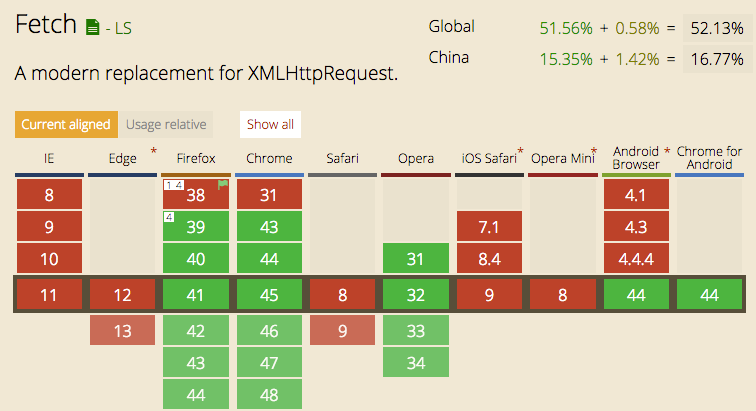

## [node-fetch](https://www.npmjs.com/package/node-fetch)

### Usage
```bash
  npm i node-fetch
```

```js

  var fetch = require('node-fetch');

  // if you are on node v0.10, set a Promise library first, eg.
  // fetch.Promise = require('bluebird');

  // plain text or html

  fetch('https://github.com/')
      .then(function(res) {
          return res.text();
      }).then(function(body) {
          console.log(body);
      });

  // json

  fetch('https://api.github.com/users/github')
      .then(function(res) {
          return res.json();
      }).then(function(json) {
          console.log(json);
      });

  // catching network error
  // 3xx-5xx responses are NOT network errors, and should be handled in then()
  // you only need one catch() at the end of your promise chain

  fetch('http://domain.invalid/')
      .catch(function(err) {
          console.log(err);
      });

  // stream
  // the node.js way is to use stream when possible

  fetch('https://assets-cdn.github.com/images/modules/logos_page/Octocat.png')
      .then(function(res) {
          var dest = fs.createWriteStream('./octocat.png');
          res.body.pipe(dest);
      });

  // buffer
  // if you prefer to cache binary data in full, use buffer()
  // note that buffer() is a node-fetch only API

  var fileType = require('file-type');
  fetch('https://assets-cdn.github.com/images/modules/logos_page/Octocat.png')
      .then(function(res) {
          return res.buffer();
      }).then(function(buffer) {
          fileType(buffer);
      });

  // meta

  fetch('https://github.com/')
      .then(function(res) {
          console.log(res.ok);
          console.log(res.status);
          console.log(res.statusText);
          console.log(res.headers.raw());
          console.log(res.headers.get('content-type'));
      });

  // post

  fetch('http://httpbin.org/post', { method: 'POST', body: 'a=1' })
      .then(function(res) {
          return res.json();
      }).then(function(json) {
          console.log(json);
      });

  // post with stream from resumer

  var resumer = require('resumer');
  var stream = resumer().queue('a=1').end();
  fetch('http://httpbin.org/post', { method: 'POST', body: stream })
      .then(function(res) {
          return res.json();
      }).then(function(json) {
          console.log(json);
      });

  // post with form-data (detect multipart)

  var FormData = require('form-data');
  var form = new FormData();
  form.append('a', 1);
  fetch('http://httpbin.org/post', { method: 'POST', body: form })
      .then(function(res) {
          return res.json();
      }).then(function(json) {
          console.log(json);
      });

  // post with form-data (custom headers)
  // note that getHeaders() is non-standard API

  var FormData = require('form-data');
  var form = new FormData();
  form.append('a', 1);
  fetch('http://httpbin.org/post', { method: 'POST', body: form, headers: form.getHeaders() })
      .then(function(res) {
          return res.json();
      }).then(function(json) {
          console.log(json);
      });

  // node 0.12+, yield with co

  var co = require('co');
  co(function *() {
      var res = yield fetch('https://api.github.com/users/github');
      var json = yield res.json();
      console.log(res);
  });

```


## fetch用法说明
---
### 语法说明
```js
  fetch(url, options)
    .then(response => {
      // handlle HTTP response
    }, error => {
      // handle network error
    })
```


##### url
- `USVString`字符串，包含要获取资源的`URL` 或者 `Request`对象

#### options (可选)
- `method`: 请求使用的方法， 如 `GET` `POST`
- `headers`: 请求的头信息， 形式为`Headers`对象或`ByteString`
- `body`: 请求的`body`信息: `Blob`, `BufferSource`, `FormData`, `URLSearchParams`, `USVString` (注意: `GRT` 或 `HEAD` 方法的请求不能包含`body`信息)
- `mode`: 请求的模式， 如 `cors`, `no-cors`, `same-origin`
- `credentials`: 请求的`credentials`， 如 `omit`, `same-origin`, `include`
- `cache`: 请求的`cache`模式： `default`, `no-store`, `reload`, `no-cache`, `force-cache`, `only-if-cached`

#### response
一个`Promise`, `reslove`时回传`Response`对象：
- 属性：
  - `status (number)` - HTTP请求结果参数，在100-599范围
  - `statusText (String)` - 服务器返回的状态报告
  - `ok (boolean)` - 如果返回200表示请求成功，则为true
  - `headers (Headers)` - 返回头部信息，下面详细介绍
  - `url (String)` - 请求的地址
- 方法：
  - `test()` - 以`string`的形式生成请求text
  - `json()` - 生成`JSON.parse(responseText)`的结果
  - `blob()` - 生成一个`Blob`
  - `arrayBuffer()` - 生成一个`ArrayBuffer`
  - `formData()` - 生成格式化的数据，可用于其他的请求
- 其他方法：
  - `clone()`
  - `Response.error()`
  - `Response.redirect()`

#### response.headers
- `has(name) (boolean)` - 判断是否存在该信息头
- `get(name) (String)` - 获取头部的数据
- `getAll(name) (Array)` - 获取所有头部数据
- `set(name, value)` - 设置信息头的参数
- `append(name, value)` - 添加header的内容
- `delete(name)` - 删除header的信息
- `forEach((value, name) => {...}, [thisContext])` - 循环读取header的信息


### 使用案例

#### GET请求
- HTML
```js
  fetch('https:www.baidu.com')
    .then(response => response.text())
    .then(body => {
      document.body.innerHTML = body;
    })
```
- IMAGE
```js
  let img = document.querySelector('img');

  fetch('test.jpg')
    .then(response => response.blob)
    .then(blob => {
      let objURL = URL.createObjectURL(blob);
      img.src = objURL;
    })
```
- JSON
```js
  fetch('https://api.github.com')
    .then(response => response.json())
    .then(data => console.log(data))
    .catch(err => console.log('error', e))
```

response数据
```js
  fetch('https://api.github.com')
    .then(res => {
      console.log(res.headers.get('Content-Type'), res.headers.get('Date'), res.status, res.statusText)
    })
```

#### POST请求
```js
  fetch('/users',{
    method: 'post',
    headers: {
      'Accept': 'application/json',
      'Content-Type': 'application/json'
    },
    body: JSON.stringify({
      name: 'lily',
      login: 'lily'
    })
  })
```

### 采用promise形式


### 浏览器支持



### 支持状况及解决方案
原生支持率并不高， 引入下面这些`polyfill`后可以完美支持IE8+ :
- 由于IE8是ES3，需要引入ES5的`polyfill: es5-shim, es5-sham`
- 引入`Promise`的`polyfill: es6-promise`
- 引入`fetch`探测库: `fetch-detector`
- 引入`fetch`的`polyfill: fetch-ie8`
- 可选: 如果你还使用了`jsonp`, 引入`fetch-jsonp`
- 可选: 开启`Babel`的`runtime`模式，现在就使用`async/await`
