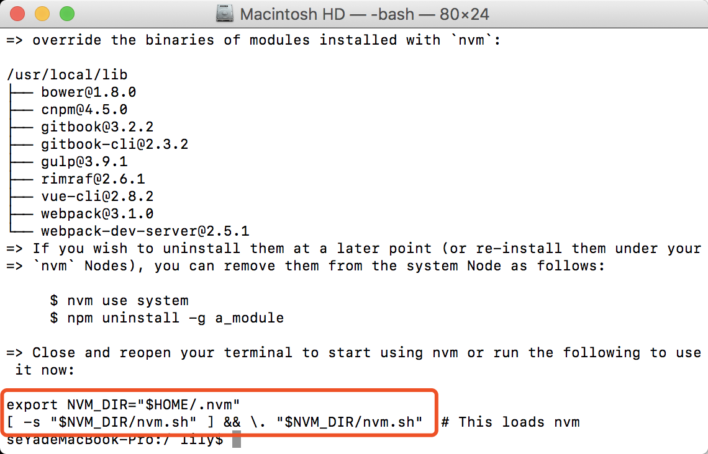

### 简介
[nvm](https://github.com/creationix/nvm)
- `nvm ls`查看本地安装的所有版本
- `nvm ls-remote`查看服务器上可安装的所有版本
- `nvm deactivate`退出已经激活的nvm
- `nvm install node`安装最新版本
- `nvm install v8.3.0`安装指定版本
- `nvm use node`使用最新版本
- `nvm use v8.3.0`使用指定版本
- `nvm --version`查看nvm版本

### OS X
```bash
sudo curl -o- https://raw.githubusercontent.com/creationix/nvm/v0.33.2/install.sh | bash
```

加入环境变量
```bash
export NVM_DIR="$HOME/.nvm"
```
```bash
[ -s "$NVM_DIR/nvm.sh" ] && \. "$NVM_DIR/nvm.sh"
```
或
```bash
source ~/.nvm/nvm.sh
```
激活，每次使用前都要激活

### linux
```bash
curl -o- https://raw.githubusercontent.com/creationix/nvm/v0.33.2/install.sh | bash
```
安装完成后，关闭当前终端

### window
在[https://github.com/coreybutler/nvm-windows/releases](https://github.com/coreybutler/nvm-windows/releases)下载相应setup
```bash
cd ~/
```
```bash
curl -o- https://raw.githubusercontent.com/creationix/nvm/v0.33.2/install.sh | bash
```
