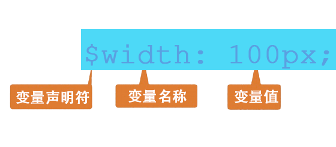

### 简介
- Sass 是一门高于 CSS 的元语言，它能用来清晰地、结构化地描述文件样式，有着比普通 CSS 更加强大的功能。
- Sass 能够提供更简洁、更优雅的语法，同时提供多种功能来创建可维护和管理的样式表。
- Sass 是最早的css预处理语言，有比less更为强大的功能。但因其一开始的缩进式语法并不能被开发者们接受，所以使用率不高，不过由于其强大的功能和Ruby on Rails 的大力推动，逐渐被更多开发者使用。
- Sass 是采用的Ruby语言编写的一款css预处理语言，它诞生于2007年，是最早成熟css预处理语言。最初它是为了配合haml而设计的，因此有着和haml一样的缩进式风格。
- Sass从第三代开始，放弃了缩进式风格，并且完全向下兼容普通的css代码，这一代的Sass也被称为Scss。
- Sass 和 SCSS 的区别：
  - 文件扩展名不同，Sass 是以“.sass”后缀为扩展名，而 SCSS 是以“.scss”后缀为扩展名
  - 语法书写方式不同，Sass 是以严格的缩进式语法规则来书写，不带大括号({})和分号(;)，而 SCSS 的语法书写和我们的 CSS 语法书写方式非常类似。
- 四种style生成后的css：
  - 嵌套输出方式 nested
  - 展开输出方式 expanded
  - 紧凑输出方式 compact
  - 压缩输出方式 compressed


### 变量
- 声明变量

  
- 变量的引用
- 普通变量和默认变量
- 局部变量和全局变量
- 嵌套-选择器嵌套
- 嵌套-属性嵌套


### 混合(mixin)
- 混合声明和调用
  - sass中使用`@mixin`声明混合，可以传递参数，参数名以`$`符号开始，多个参数以逗号分开，也可以给参数设置默认值、声明的`@mixin`通过`@include`来调用。
- 无参数mixin
```scss
@mixin center-block{
  margin: auto;
}
```
- 有参数mixin
```scss
@mixin opacity($opacity:50) {
  opacity: $opacity / 100;
  filter: alpha(opacity=$opacity);
}
```
- 多个参数mixin
```scss
@mixin horizontal-line($border:1px dashed #ccc, $padding:10px){
    border-bottom:$border;
    padding-top:$padding;
    padding-bottom:$padding;  
}
```
- 多组值参数mixin
  - 如果一个参数可以有多组值，如`box-shadow` `transition`等，那么参数则需要在变量后加三个点`...`表示，如`$variables...`
  ```scss
  @mixin box-shadow($shadow...){
      -webkit-border-radius: $shadow;
      box-shadow: $shadow;
  }
  ```
  调用
  ```scss
  .box{
      border: 1px solid #ccc;
      @include box-shadow(0 2px 2px rgba(0,0,0,.3),0 3px 3px rgba(0,0,0,.3),0 4px 4px rgba(0,0,0,.3));
  }
  ```
  结果
  ```scss
  .box{
    border:1px solid #ccc;
    -webkit-box-shadow:0 2px 2px rgba(0,0,0,.3),0 3px 3px rgba(0,0,0,.3),0 4px 4px rgba(0,0,0,.3);
    box-shadow:0 2px 2px rgba(0,0,0,.3),0 3px 3px rgba(0,0,0,.3),0 4px 4px rgba(0,0,0,.3);
  }
  ```


### 继承


### Sass基本特性
- 占位符 `%` placeholder
- 数据类型
- 字符串
- 值列表


### 运算
- 数字运算
- 除法运算和
- 颜色运算
- 字符串运算


### 条件判断及循环
- if判断
  - `@if` `@else`
  - 除非必要，不认不需要括号
  - 务必在 `@if` 之前添加空行
  - 务必在左开大括号 `{` 后换行
  - `@else` 语句和它前面的右闭大括号 `}` 写在同一行
  - 务必在右闭大括号 `}` 后添加空行，除非下一行还是右闭大括号 `}` ，那么就在最后一个右闭大括号 `}` 后添加空行

  ```scss
  p {
    @if 1 + 1 == 2 { border: 1px; }
    @if 5< 3 { border: 2px; }
    @if null { border: 3px }
  }

  // 结果
  p {
    border: 1px;
  }
  ```
  ```scss
  p {
    @if 1 + 1 == 2 {
      width: 30px;
    }@else{
      width: 50px;
    }
  }

  // 结果
  p {
    width: 30px;
  }
  ```
- 三目运算判断
  - if(`$condition`, `$condition_true`, `$condition_false`)
  - 三个参数分别表示：条件，条件为真的值，条件为假的值

  ```scss
  $fontBold: true;
  p {
    font-weight: if($fontBold, bold, normal);
  }

  // 结果
  p {
    font-weight: bold;
  }
  ```
- for循环
  - @for $i from start through end
  - @for $i from start to end
  - `$i`变量 `start`起始值 `end`结束值
  - `through`包括`end`这个数，`to`不包括`end`这个数

  ```scss
  @for $i from 1 through 3 {
    .item-#{$i} {
      width: 2em * $i;
    }
  }

  // 结果
  .item-1 {
    width: 2em; }
  .item-2 {
    width: 4em; }
  .item-3 {
    width: 6em; }
  ```
  ```scss
  @for $i from 1 to 3 {
    .item-#{$i} {
      width: 2em * $i;
    }
  }

  // 结果
  .item-1 {
    width: 2em; }
  .item-2 {
    width: 4em; }
  ```
- each循环
  - @each 循环指令的形式： `@each $var in <list>`
  - `$var`一个变量名， `<list>`一个SassScript表达式

  ```scss
  @each $animal in puma, egret, salamander {
    .#{$animal}-icon {
      background-image: url('/img/#{$animal}.png');
    }
  }

  // 结果
  .puma-icon {
    background-image: url('/img/puma.png'); }
  .egret-icon {
    background-image: url('/egret.png'); }
  .salamander-icon {
    background-image: url('/img/salamander.png'); }
  ```
- while循环
  - `@while`指令也需要SassScript表达式

  ```scss
  $i: 6;
  @while $i > 0 {
    .item-#{$i} {
      width: 2em * $i;
    }
    $i: $i - 2;
  }

  // 结果
  .item-6 {
  width: 12em; }
  .item-4 {
    width: 8em; }
  .item-2 {
    width: 4em; }
  ```
